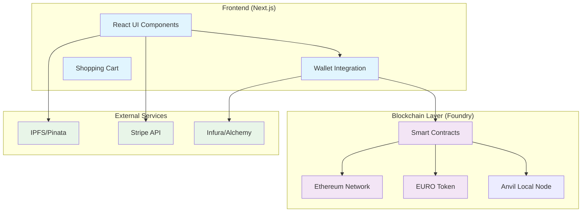
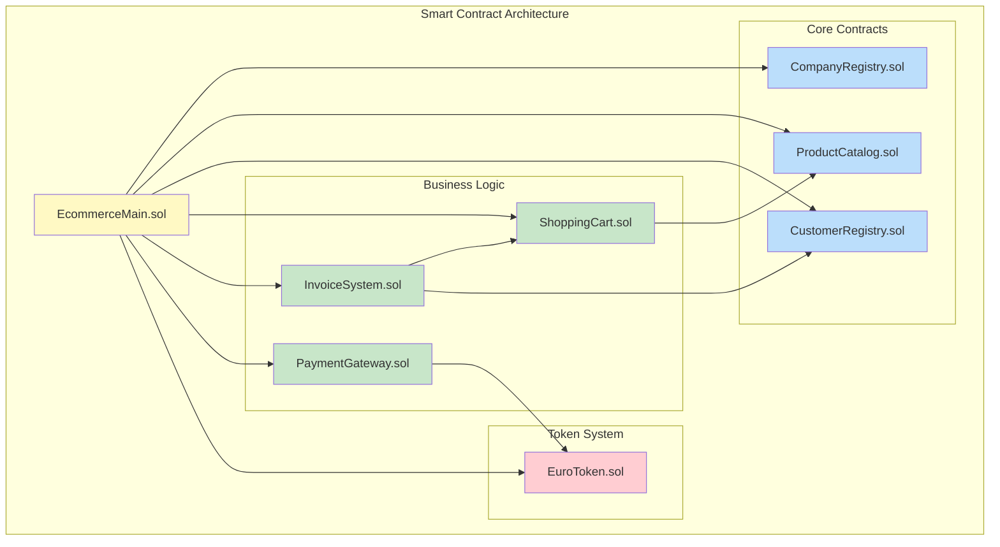
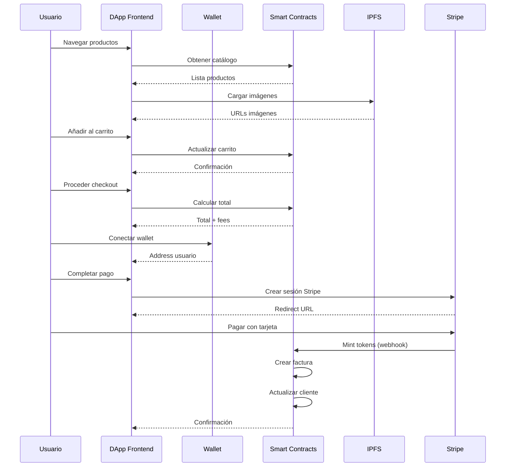
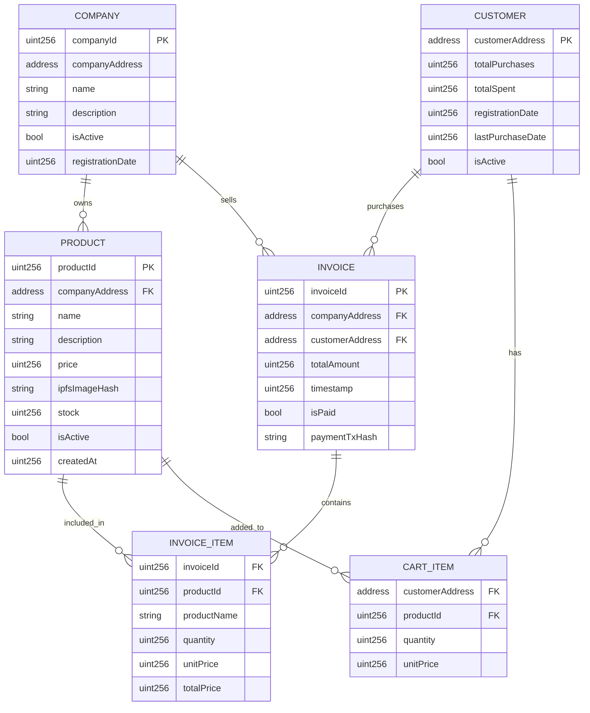
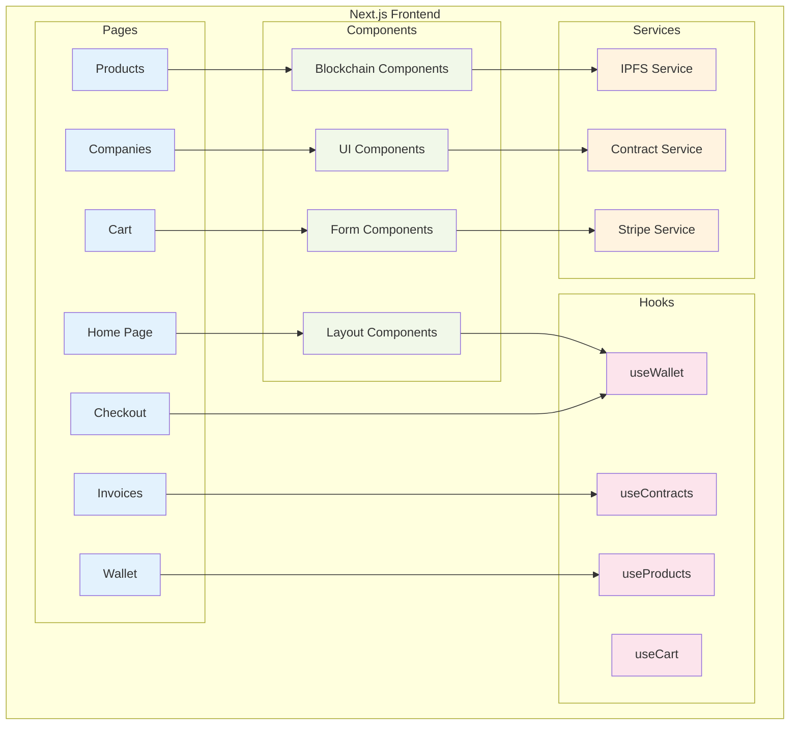
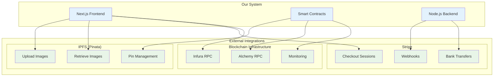
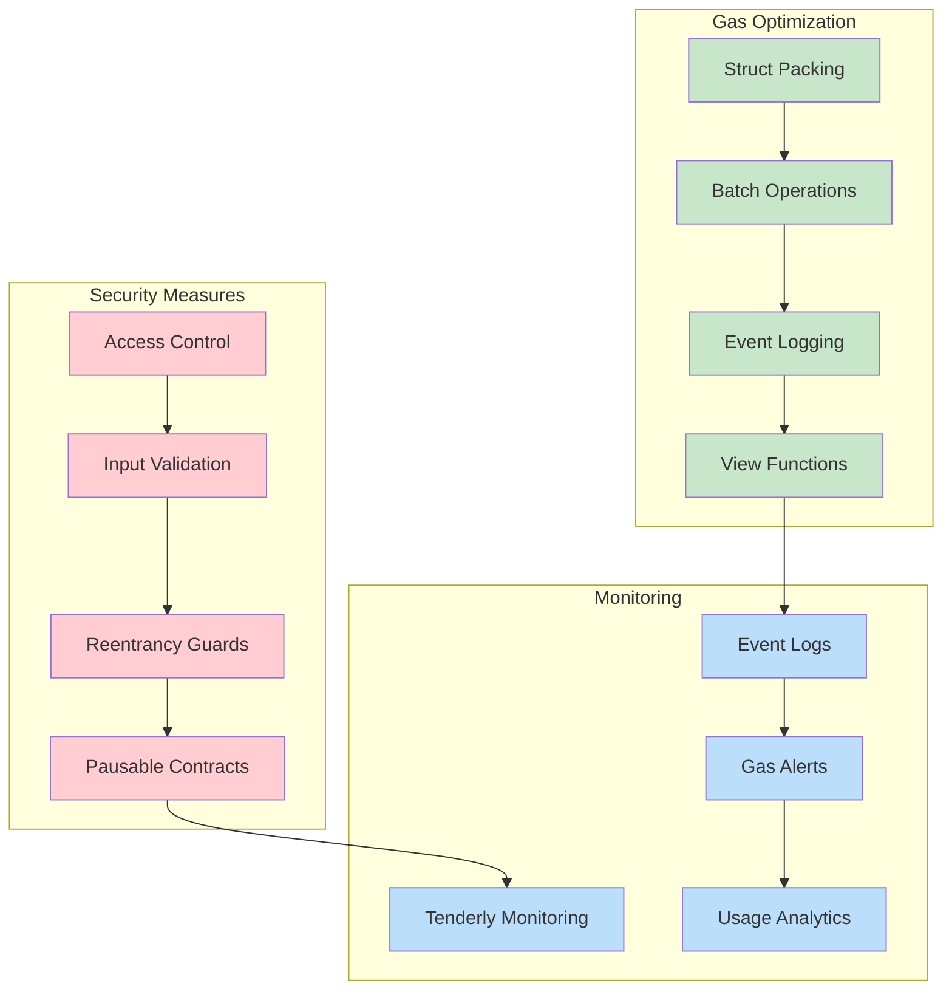

# ARQUITECTURA DEL SISTEMA E-COMMERCE BLOCKCHAIN

## 1. ARQUITECTURA GENERAL DEL SISTEMA

## 2. ARQUITECTURA DE SMART CONTRACTS

## 3. FLUJO DE COMPRA

## 4. ARQUITECTURA DE DATOS

## 5. ARQUITECTURA DE FRONTEND

## 6. FLUJO DE PAGOS

```mermaid
graph TB
    subgraph "Payment Flow"
        Start([Usuario inicia compra])
        
        subgraph "Compra de Tokens"
            Buy1[Usuario solicita tokens]
            Buy2[Crear sesión Stripe]
            Buy3[Pagar con tarjeta]
            Buy4[Webhook confirma pago]
            Buy5[Mint tokens en blockchain]
        end
        
        subgraph "Pago de Productos"
            Pay1[Usuario completa carrito]
            Pay2[Calcular total]
            Pay3[Transferir tokens]
            Pay4[Crear factura]
            Pay5[Actualizar inventario]
        end
        
        subgraph "Retiro de Tokens"
            Withdraw1[Usuario solicita retiro]
            Withdraw2[Validar balance]
            Withdraw3[Burn tokens]
            Withdraw4[Transferir euros via Stripe]
        end
        
        Start --> Buy1
        Buy1 --> Buy2
        Buy2 --> Buy3
        Buy3 --> Buy4
        Buy4 --> Buy5
        Buy5 --> Pay1
        
        Pay1 --> Pay2
        Pay2 --> Pay3
        Pay3 --> Pay4
        Pay4 --> Pay5
        
        Pay5 --> Withdraw1
        Withdraw1 --> Withdraw2
        Withdraw2 --> Withdraw3
        Withdraw3 --> Withdraw4
    end
    
    classDef buy fill:#c8e6c9
    classDef pay fill:#bbdefb
    classDef withdraw fill:#ffcdd2
    
    class Buy1,Buy2,Buy3,Buy4,Buy5 buy
    class Pay1,Pay2,Pay3,Pay4,Pay5 pay
    class Withdraw1,Withdraw2,Withdraw3,Withdraw4 withdraw
```

## 7. INTEGRACIÓN CON SERVICIOS EXTERNOS

## 8. SECURITY & GAS OPTIMIZATION

